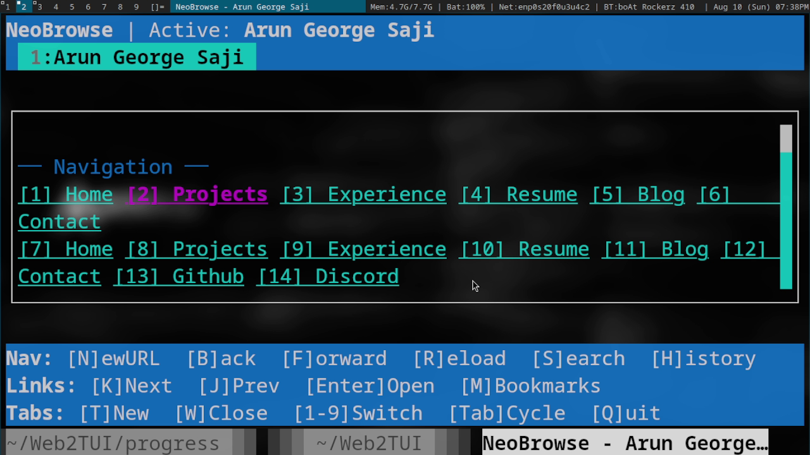

# NeoBrowse - TUI Web Browser 
 

A powerful terminal-based browser with a TUI interface, built with Node.js and Blessed.

> **Linux-Optimized**: NeoBrowse is primarily designed for working with Linux systems. You might face big hurdles while trying it out in any other OS including major rendering issues and even it flat out not running as you have to manually modify the commands to work with your OS.

## Features
- TUI interface with keyboard navigation
- Fast rendering of simplified HTML content
- Multiple tabs support
- Integrated URL/search bar (Even supports local files)
- Bookmarks management
- Browsing history
- Customizable settings
- Advanced inbuilt debugger and warnings system 
- More advanced features coming soon!

## Quick Start (Recommended)

Run NeoBrowse instantly using Docker - designed specifically for Linux:

```bash
docker pull arunchess/neobrowse:latest && \
docker run -it --rm -u $(id -u):$(id -g) -v "$HOME:$HOME" -e "HOME=$HOME" arunchess/neobrowse
```

### Local Installation

If you prefer to run NeoBrowse locally, run the following commands:

```bash
git clone https://github.com/arungeorgesaji/NeoBrowse.git
cd NeoBrowse
npm install
npm start
```
